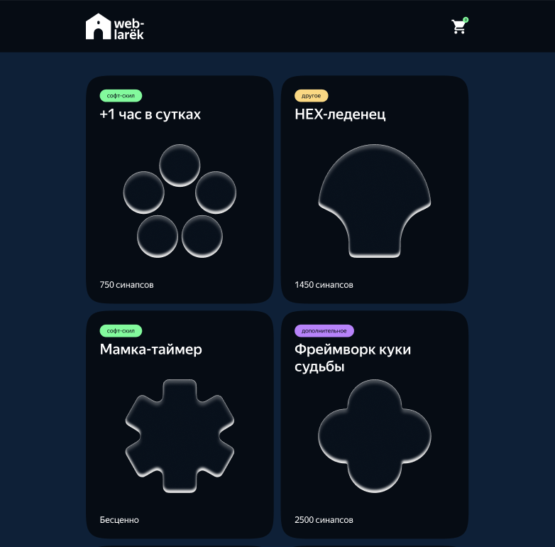
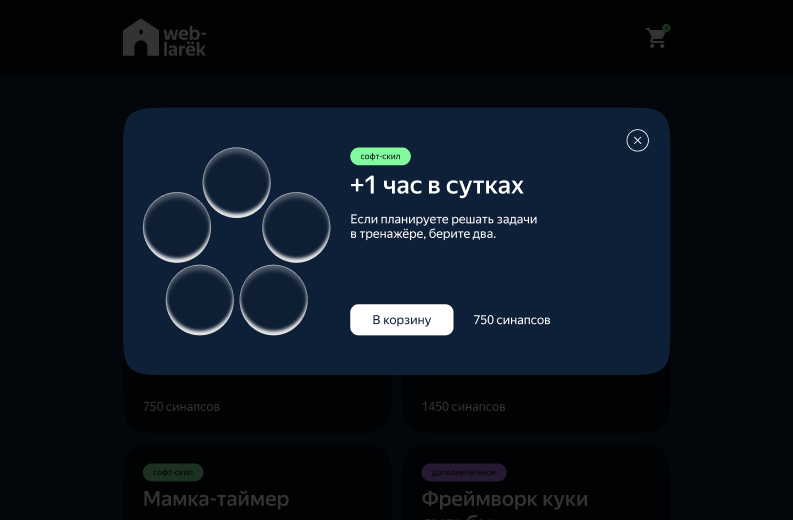

# Проектная работа "Веб-ларек"

## Стек

<a href="https://www.w3.org/TR/2011/WD-html5-20110405/"></a>
<a href="https://sass-lang.com/"></a>
<a href="https://www.typescriptlang.org/"></a>
<a href="https://webpack.js.org/"></a>

---

## Структура проекта

- src/ — исходные файлы проекта
- src/components/ — папка с JS компонентами
- src/components/base/ — папка с базовым кодом

---

## Важные файлы

- src/pages/index.html — HTML-файл главной страницы
- src/types/index.ts — файл с типами
- src/index.ts — точка входа приложения
- src/scss/styles.scss — корневой файл стилей
- src/utils/constants.ts — файл с константами
- src/utils/utils.ts — файл с утилитами

---

## Установка и запуск

Для установки и запуска проекта необходимо выполнить команды

```
npm install
npm run start
```

или

```
yarn
yarn start
```

---

## Сборка

```
npm run build
```

или

```
yarn build
```

---

## Описание проекта

**"Веб-ларек"** — это интернет-магазин.  
Его ключевые компоненты включают главную страницу со списком товаров и иконкой корзины, а также различные модальные окна, которые позволяют пользователям просматривать детали товаров и оформлять заказы.

---

### Скриншоты

  


---

## Макет проекта

Макет проекта можно посмотреть по [Ссылка на макет](https://www.figma.com/design/50YEgxY8IYDYj7UQu7yChb/Веб-ларёк?node-id=1-735&t=FMeANR9pPSSAO4YU-0)

# Интерфейсы и типы

### interface IProduct

```
interface IProduct {
  	id: string;
	description: string;
	image: string;
	title: string;
	category: string;
	price: number | null;
}
```

Используется для описания товара в магазине.  
Содержит ключевые характеристики: идентификатор, название, описание, категорию, изображение и цену.

### interface IProducts

```
export interface IProducts {
	total: number | null;
	items: IProduct[];
}
```

Нужен для описания массива всех товаров.

### interface ICard

```
export interface ICard {
	render(data: IProduct): HTMLElement;
}
```

Реализует карточку товара.

Метод который используем:

- `render(product: IProduct): HTMLElement` - нужен для получиения готового элемента.

### interface IErrorMessage

```
export interface IErrorMessage {
	error: string;
}
```

Отвечает за вывод ошибки с сервера.

### interface IBasketModel

```
export interface IBasketModel {
	add(item: Partial<IProduct>): void;
	remove(item: Partial<IProduct>): void;
	clear(): void;
	total: number;
}
```

Отвечает за функциональность корзины товара.  
Используются методы для взаимодействия с данными(добавление товара в корзину, удаление товара из корзины).

### interface IBasketModel

```
export interface IBasketContent {
	template: HTMLTemplateElement;
	render(): HTMLElement;
}
```

Отвечает за отображение корзины товара на сайте.

### interface IEventEmitter

```
export interface IEventEmitter {
	emit: (event: string, data?: unknown) => void;
}
```

Интерфейс EventEmitter обеспечивает работу событий.  
Его функции: возможность установить и снять слушателей событий, вызвать слушателей при возникновении события.

### interface IEventData

```
export interface IEventData {
	element: HTMLElement;
	data?: Partial<IProduct>;
}
```

Интерфейс данных для передачи в eventEmitter(слушатель событий).  
Необходим для его корректной работы.

### interface ISuccessContent

```
export interface ISuccessContent {
	template: HTMLTemplateElement;
	render(): HTMLElement;
}
```

Интерфейс, который описывает успешную оплату товара.

### interface IOrderResult

```
export interface IOrderResult {
	id: string;
	total: number;
}
```

Интерфейс для описания результата заказа товара.

### interface IRegistrationOrder

```
export interface IRegistrationOrder {
	payment: string;
	email: string;
	phone: string;
	address: string;
	total: number;
	items: string[];
}
```

Интерфейс формы оформления заказа товара.

### interface IOrderModel

```
export interface IOrderModel {
	order: IRegistrationOrder;
	isValid(order: IRegistrationOrder): boolean;
}
```

Интерфейс валидации формы оформления заказа товара.

### interface IModalWork

```
export interface IModalWork {
	openModal: (element: HTMLElement) => void;
	closeModal: () => void;
}
```

Интерфейс для работы модальных окон.

---

# События

#### Генерируемые события приложения:

- `modal: open` - событие открытия модального окна
- `modal: close` - событие закрытия модального окна
- `form-contacts: open` - открытие формы с номерами телефонов и email
- `adress: submit` - подтверждение формы с адресом заказа и способом оплаты
- `contacts: submit` - подтверждение и отправка заказа на сервер
- `success: close` - закрытие окна успешной отправки формы
- `formValidatedAddress: change` - изменение состояния валидации формы с адресом заказа и способом оплаты
- `formValidatedContacts: change` - изменение состояния валидации формы с номерами телефонов и email
- `form-adress: open` - открытие формы с адресом заказа и способом оплаты
- `basket: open` - открытие корзины товара
- `basket: removeproduct` - удаление карточки из корзины
- `basket: submit` - подтверждение данных корзины

#### Системные события:

- `products: changed` - изменение массива карточек
- `product: selected` - изменение открываемой в модальном окне карточки

---

## Архитектура приложения

Для разработки архитектуры приложения интернет-магазина был выбран шаблон **MVP**.  
Этот подход разделяет приложение на три основных уровня:

- **Модель (Model)**: Отвечает за бизнес-логику и управление данными.

- **Представление (View)**: Отображает информацию пользователю и обрабатывает его действия.

- **Презентер (Presenter)**: Выступает связующим звеном между моделью и представлением. Все взаимодействия между моделью и представлением осуществляются только через презентер.

---

# Описание классов:

## Слой данных (Model):

Представлен следующими классами: ProductsModel, BasketModel и OrderModel.

#### Класс ProductsModel

Класс отвечает за хранение и управление данными товарных карточек.  
Конструктор класса принимает экземпляр брокера событий.

В качестве полей класса используются следующие данные:

- `_products: IProduct[]` - список объектов, представляющих товарные карточки.
- `_preview: string | null` - идентификатор карточки, выбранной для отображения в модальном окне.
- `events: IEvents` - объект класса EventEmitter, используемый для генерации событий.

Используется для работы с данными:

Методы для установки (сеттеры) и получения (геттеры) значений полей класса.

#### Класс BasketModel

Класс управляет данными корзины, включая добавление и удаление товаров.  
Конструктор класса принимает экземпляр брокера событий.

В качестве полей класса используются следующие данные:

- `_items: Map<string, number>` - структура данных, содержащая сведения о товарах, находящихся в корзине.
  `Ключ:` идентификатор товара. </br>
  `Value:` цена товара. </br>
- `_total: number` - суммарная цена всех товаров, добавленных в корзину.

Методы для взаимодействия с данными:

- `add(item: string): void` - добавление товара в корзину.
- `remove(item: string): void` - удаление товара из корзины

- Методы для установки (сеттеры) и получения (геттеры) значений полей класса.

#### Класс OrderModel

Класс управляет хранением и логикой обработки заказа.  
Конструктор класса принимает экземпляр брокера событий.

В качестве полей класса используются следующие данные:

- `_order: IRegistrationOrder` - объект в котором содержится информация о заказе.

Методы для взаимодействия с данными:

- `isValid(order: IRegistrationOrder): boolean` - проверяет валидность заполненных данных.
- Методы для установки (сеттеры) и получения (геттеры) значений полей класса.

---

### Слой представления (View).

Каждый класс представления обеспечивает отображение переданных данных внутри заданного контейнера (DOM-элемента).

#### Класс Page

Отвечает за создание главной страницы — каталога товаров с отображением счётчика.  
Содержит набор сеттеров, которые управляют DOM-элементами главной страницы.  
Конструктор класса принимает HTMLTemplateElement и экземпляр брокера событий.

В качестве полей класса используются следующие данные:

- `_counter` - элемент счетчика на странице.
- `_catalog` - элемент каталога на странице.
- `_wrapper` - элемент обертки на странице.
- `_basket` - элемент корзины на странице.

Также есть следующие сеттеры:

- `counter` - меняет содержимое счетчика на полученное.
- `catalog` - меняет содержмое каталога на полученные элементы.
- `locked` - меняет класс обертки на значение, соответствующее переданному.

#### Класс Card

Реализует карточку.  
Конструктор класса принимает HTMLTemplateElement и экземпляр брокера событий.

В качестве полей класса используются следующие данные:

- `_id: string` - id.
- `_description: string` - описание.
- `_image: string` - картинка.
- `_title: string` - заголовок.
- `_category: string` - категория.
- `_price: number | null` - цена.

Методы в классе:

- `render(product: IProduct): HTMLElement` - получает готовый элемент.

#### Класс Modal

Обеспечивает отображение контента через модальное окно.  
Конструктор класса принимает HTMLTemplateElement, HTMLElement (контейнер) и экземпляр брокера событий.

В качестве полей класса используются следующие данные:

- `closeButton: HTMLButtonElement` - кнопка закрытия модального окна.
- `_content: HTMLElement` - контент, который необходимо отобразить.
- `modalContainer: HTMLElement` - контейнер модального окна.

Методы в классе:

- `element: HTMLElement` - получает готовый элемент.
- `open(): void` - открывает модальное окно.
- `close(): void` - закрывает модальное окно.

#### Класс BasketContent

Отвечает за отображение содержимого корзины товаров.  
Конструктор класса принимает HTMLTemplateElement и экземпляр брокера событий.

В качестве полей класса используются следующие данные:

- `button-order` - кнопка "Оформить".
- `button-delete` - кнопка "Удалить".

Методы в классе:

- `render(): HTMLElement` - получает готовый элемент.

#### Класс SuccessContent

Отвечает за отображение контента успешного оформления заказа.  
Конструктор класса принимает HTMLTemplateElement и экземпляр брокера событий.

В качестве полей класса используются следующие данные:

- `button-success` - кнопка "За новыми покупками!".

Методы в классе:

- `render(): HTMLElement` - получает готовый элемент.

#### Класс ContactsContent

Отображает контент контактов.  
Конструктор класса принимает HTMLTemplateElement и экземпляр брокера событий.

В качестве полей класса используются следующие данные:

- `inputPhone` - элемент для ввода номера телефона.
- `button-pay` - кнопка "Оплатить".
- `inputEmail` - элемент для ввода почты.

Методы в классе:

- `render(): HTMLElement` - получает готовый элемент.

#### Класс OrderContent

Отображает контент оформления заказа.  
Конструктор класса принимает HTMLTemplateElement и экземпляр брокера событий.

В качестве полей класса используются следующие данные:

- `inputAdress` - инпут для ввода адреса.
- `button-next` - кнопка "Далее".

Методы в классе:

- `render(): HTMLElement` - получает готовый элемент.

#### Класс ProductContent

Отображает контент с карточкой товара.  
Конструктор класса принимает HTMLTemplateElement и экземпляр брокера событий.

В качестве полей класса используются следующие данные:

- `button-buy` - кнопка "Купить"

Методы в классе:

- `render(product: IProduct): HTMLElement` - получает готовый элемент.

---

### Базовый код

#### Класс Api

Включает основную логику взаимодействия с сервером, позволяя получать и отправлять данные.  
Конструктор принимает базовый URL сервера и объект с заголовками запросов.

Методы:

- `get` - GET запрос на Api и возвращает promise с объектом (которым ответил сервер)
- `post` - принимает объект с данными, далее они будут переданы в JSON в теле запроса, и отправлены на Api

#### Класс Event

Стандартная реализация брокера событий.  
Предоставляет возможность отправлять события и подписываться на них, отслеживая происходящие в системе изменения.  
Класс применяется в презентере для обработки событий и в различных слоях приложения для их генерации.

Методы, реализуемые классом описаны интерфейсом `IEvents`:

- `trigger` - возвращает функцию, при вызове которой инициализируется требуемое в параметрах событие.
- `on` - подписка на событие.
- `emit` - инициализация события.
